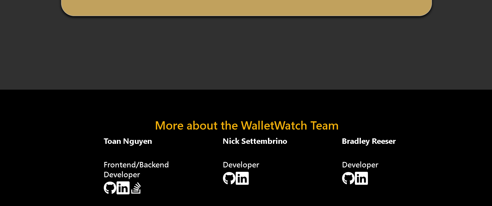

# Wallet Watch

## Overview

Wallet Watch is a user-friendly budget tracking application designed to help users efficiently manage their expenses and allocate their funds effectively. With intuitive features and a simple interface, users can easily track their spending, set budgets, and gain better control over their finances.

## Features

- User-Friendly Interface: Wallet Watch provides a clean and intuitive interface that makes budget tracking effortless and enjoyable.
- Expense Tracking: Easily track your daily expenses and categorize them for better analysis.
- Budget Management: Set up monthly budgets tailored to your specific needs and financial goals.
- Income Management: Keep track of your income sources and monitor your overall financial health.
- Customizable Categories: Customize expense categories to match your spending habits and preferences.
- Secure Account Creation: Create a secure account to store your financial data safely and access it from anywhere.

## Usage

- Sign Up: Start by signing up for an account on the Wallet Watch platform. Simply click the "Get Started!" button on the live URL and follow the prompts to create your account.
- Set Up Budgets: Once logged in, navigate to the "Add Budget" section to create your monthly budget. Enter the date, month, and year for your budget, and it will be added to your profile.
- Track Expenses: Begin tracking your expenses by entering them into the app. Categorize your expenses and monitor your spending habits to stay within your budget.
- Monitor Financial Health: Use Wallet Watch to monitor your financial health, track your progress towards your savings goals, and make informed decisions about your finances.

## Screenshots

## Links

- [Live Application](https://wallet-watch-6ct1.onrender.com/)

- [Repository Link](https://github.com/nsettyy/wallet-watch)

## Colaborators

- [Toan Nguyen](https://github.com/nguyent0275)
- [Nick Settembrino](https://github.com/nsettyy)
- [Bradley Reeser](https://github.com/BorzoiBurrow)
- [Savannah Klinger](https://github.com/savannahjk02)
- [Jonathan Torres Bones](https://github.com/TorresBones)

## License

MIT License

Copyright (c) 2024 nsettyy

Permission is hereby granted, free of charge, to any person obtaining a copy
of this software and associated documentation files (the "Software"), to deal
in the Software without restriction, including without limitation the rights
to use, copy, modify, merge, publish, distribute, sublicense, and/or sell
copies of the Software, and to permit persons to whom the Software is
furnished to do so, subject to the following conditions:

The above copyright notice and this permission notice shall be included in all
copies or substantial portions of the Software.

THE SOFTWARE IS PROVIDED "AS IS", WITHOUT WARRANTY OF ANY KIND, EXPRESS OR
IMPLIED, INCLUDING BUT NOT LIMITED TO THE WARRANTIES OF MERCHANTABILITY,
FITNESS FOR A PARTICULAR PURPOSE AND NONINFRINGEMENT. IN NO EVENT SHALL THE
AUTHORS OR COPYRIGHT HOLDERS BE LIABLE FOR ANY CLAIM, DAMAGES OR OTHER
LIABILITY, WHETHER IN AN ACTION OF CONTRACT, TORT OR OTHERWISE, ARISING FROM,
OUT OF OR IN CONNECTION WITH THE SOFTWARE OR THE USE OR OTHER DEALINGS IN THE
SOFTWARE.
